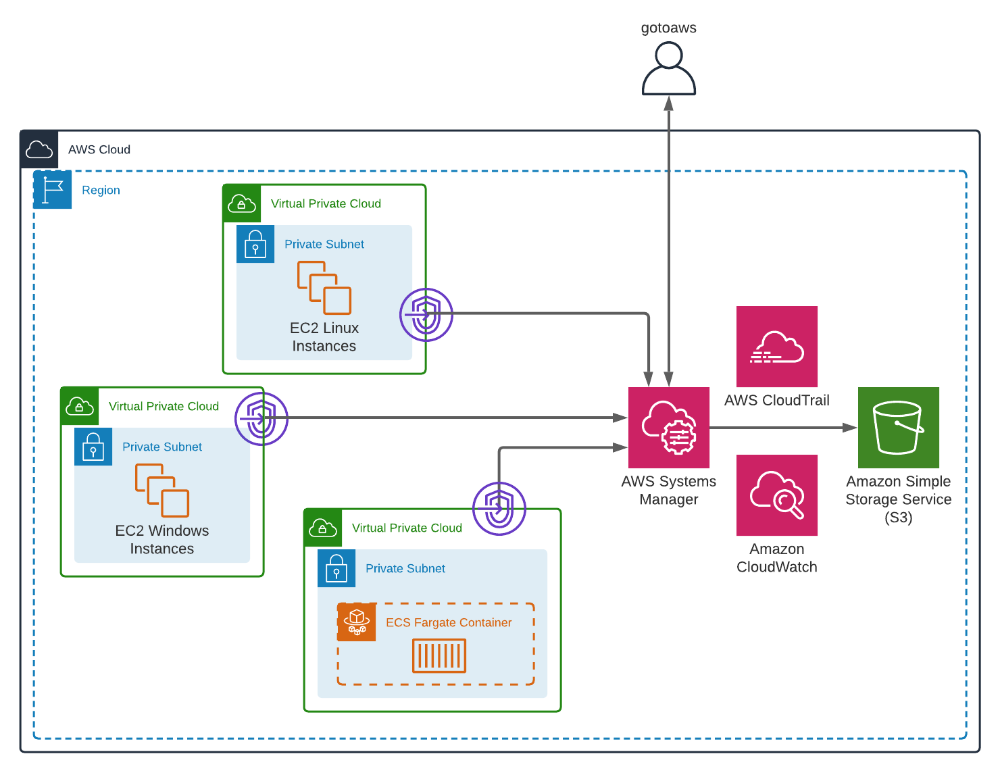

<p align="center">
  
  <h3 align="center">gotoaws</h3>
</p>

`gotoaws` is an interactive CLI tool that you can use to connect to your AWS resources (EC2, ECS container) using the [AWS Systems Manager Session Manager](https://docs.aws.amazon.com/systems-manager/latest/userguide/session-manager.html). It provides secure and auditable resource management without the need to open inbound ports, maintain bastion hosts, or manage SSH keys.



## Prerequisites
- [session-manager-plugin](https://docs.aws.amazon.com/systems-manager/latest/userguide/session-manager-working-with-install-plugin.html) must be installed on your client
- SSM Agent version 2.3.672.0 or later must be installed on the instances you want to connect to through sessions
- An instance profile with proper IAM permissions (e.g AmazonSSMManagedInstanceCore)
- A connection to the AWS System Manager Servive via NAT or better via [VPC Endpoint](https://docs.aws.amazon.com/vpc/latest/privatelink/vpc-endpoints.html) to further reduce the attack surface
- [Prerequisites for using ECS Exec](https://docs.aws.amazon.com/AmazonECS/latest/developerguide/ecs-exec.html)
## Installing
You can install the pre-compiled binary in several different ways

### homebrew tap:
```bash
brew tap hupe1980/gotoaws
brew install gotoaws
```

### snapcraft:
[](https://snapcraft.io/gotoaws)
```bash
sudo snap install --classic gotoaws
```

### scoop:
```bash
scoop bucket add gotoaws https://github.com/hupe1980/gotoaws-bucket.git
scoop install gotoaws
```

### deb/rpm/apk:

Download the .deb, .rpm or .apk from the [releases page](https://github.com/hupe1980/gotoaws/releases) and install them with the appropriate tools.

### manually:
Download the pre-compiled binaries from the [releases page](https://github.com/hupe1980/gotoaws/releases) and copy to the desired location.

## How to use
```
Usage:
  gotoaws [command]

Available Commands:
  completion  Prints shell autocompletion scripts for gotoaws
  ec2         Connect to ec2
  ecs         Connect to ecs
  help        Help about any command

Flags:
  -h, --help               help for gotoaws
      --profile string     AWS profile (optional) (default "default")
      --region string      AWS region (optional)
      --timeout duration   timeout for network requests (default 15s)
  -v, --version            version for gotoaws

Use "gotoaws [command] --help" for more information about a command.
```

## EC2
You can connect to your instances by name, ID, DNS, IP or select an instance from a list.
```
Usage:
  gotoaws ec2 [command]

Available Commands:
  fwd         Port forwarding
  run         Run commands
  scp         SCP over Session Manager
  session     Start a session
  ssh         SSH over Session Manager

Flags:
  -h, --help   help for ec2

Global Flags:
      --profile string     AWS profile (optional) (default "default")
      --region string      AWS region (optional)
      --timeout duration   timeout for network requests (default 15s)

Use "gotoaws ec2 [command] --help" for more information about a command.
```
#### Start a session
```
Usage:
  gotoaws ec2 session [flags]

Examples:
gotoaws ec2 session -t myserver

Flags:
  -h, --help            help for session
  -t, --target string   name|ID|IP|DNS of the instance (optional)

Global Flags:
      --profile string     AWS profile (optional) (default "default")
      --region string      AWS region (optional)
      --timeout duration   timeout for network requests (default 15s)
```
#### Port forwarding
```
Usage:
  gotoaws ec2 fwd [flags]

Examples:
gotoaws fwd run -t myserver -l 8080 -r 8080

Flags:
  -h, --help            help for fwd
  -l, --local string    local port to use (required)
  -r, --remote string   remote port to forward to (required)
  -t, --target string   name|ID|IP|DNS of the instance (optional)

Global Flags:
      --profile string     AWS profile (optional) (default "default")
      --region string      AWS region (optional)
      --timeout duration   timeout for network requests (default 15s)
```

#### Run commands
```
Usage:
  gotoaws ec2 run [flags]

Examples:
gotoaws ec2 run -t myserver -c 'cat /etc/passwd'

Flags:
  -c, --cmd string      command to exceute (required)
  -h, --help            help for run
  -t, --target string   name|ID|IP|DNS of the instance (optional)

Global Flags:
      --profile string     AWS profile (optional) (default "default")
      --region string      AWS region (optional)
      --timeout duration   timeout for network requests (default 15s)
```

#### SSH over Session Manager
```
Usage:
  gotoaws ec2 ssh [command] [flags]

Examples:
gotoaws ssh -t myserver -i key.pem

Flags:
  -h, --help              help for ssh
  -i, --identity string   file from which the identity (private key) for public key authentication is read (required)
  -L, --lforward string   local port forwarding (optional)
  -p, --port string       SSH port to us (optional) (default "22")
  -t, --target string     name|ID|IP|DNS of the instance (optional)
  -l, --user string       SSH user to us (optional) (default "ec2-user")

Global Flags:
      --profile string     AWS profile (optional) (default "default")
      --region string      AWS region (optional)
      --timeout duration   timeout for network requests (default 15s)
```

#### SCP over Session Manager
```
Usage:
  gotoaws ec2 scp [source(s)] [target] [flags]

Examples:
gotoaws ec2 scp file.txt /opt/ -t myserver -i key.pem

Flags:
  -h, --help              help for scp
  -i, --identity string   file from which the identity (private key) for public key authentication is read (required)
  -p, --port string       SSH port to us (optional) (default "22")
  -R, --recv              receive files from target (optional)
  -t, --target string     name|ID|IP|DNS of the instance (optional)
  -l, --user string       SCP user to us (optional) (default "ec2-user")

Global Flags:
      --profile string     AWS profile (optional) (default "default")
      --region string      AWS region (optional)
      --timeout duration   timeout for network requests (default 15s)
```

## ECS
You can directly interact with containers without needing to first interact with the host container operating system, open inbound ports, or manage SSH keys.
 
```
Usage:
  gotoaws ecs [command]

Available Commands:
  exec        Exec into container

Flags:
  -h, --help   help for ecs

Global Flags:
      --profile string     AWS profile (optional) (default "default")
      --region string      AWS region (optional)
      --timeout duration   timeout for network requests (default 15s)

Use "gotoaws ecs [command] --help" for more information about a command.
```

### Exec into container
```
Usage:
  gotoaws ecs exec [flags]

Examples:
gotoaws ecs exec --cluster demo-cluster

Flags:
      --cluster string     arn or name of the cluster (optional) (default "default")
  -c, --cmd string         command to exceute (optional) (default "/bin/sh")
      --container string   name of the container. A container name only needs to be specified for tasks containing multiple containers. (optional)
  -h, --help               help for exec
      --task string        arn or id of the task (optional)

Global Flags:
      --profile string     AWS profile (optional) (default "default")
      --region string      AWS region (optional)
      --timeout duration   timeout for network requests (default 15s)
```
## License
[MIT](LICENCE)